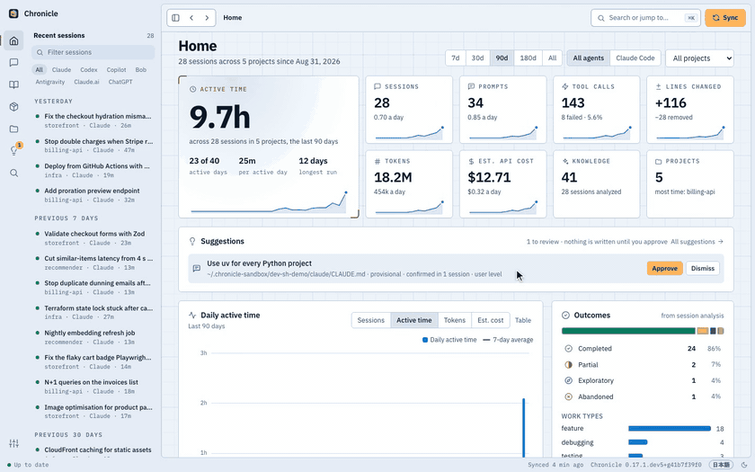
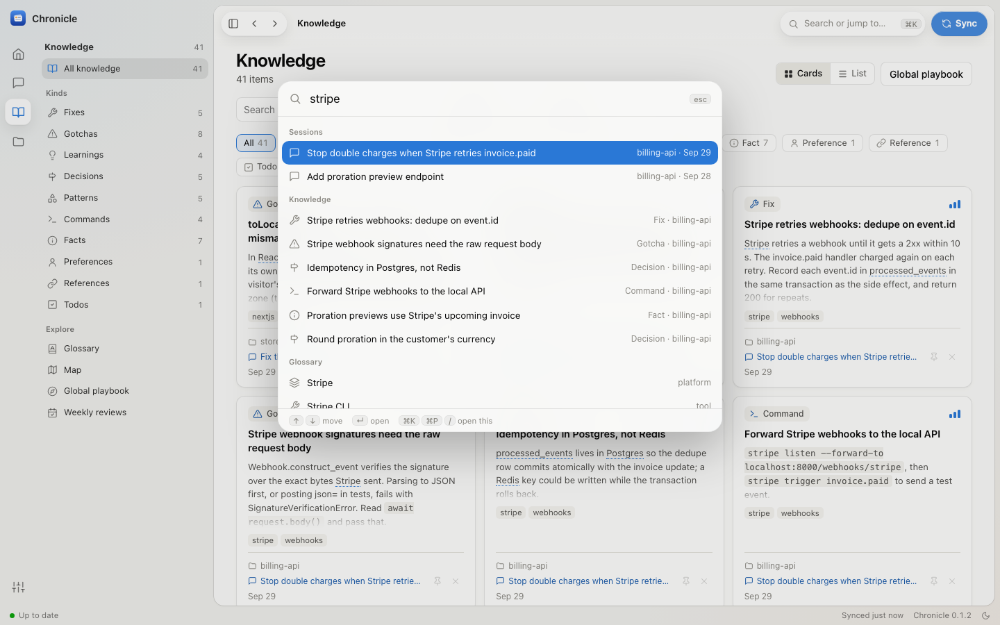

<p align="center"></p>

<h1 align="center">Interlatch</h1>

<p align="center"><b>Different agents. Knowledge that stays.</b><br>
Shared memory for your coding agents. Claude Code, Codex, GitHub Copilot, IBM Bob and Google Antigravity sessions and your
claude.ai and ChatGPT chats, recorded on your own machine, and every lesson in them linked to the session it came from.</p>

<p align="center">
  <a href="https://pypi.org/project/interlatch/"></a>
  
  
  <a href="LICENSE"></a>
  <a href="https://github.com/Chatixia-AI/interlatch/pkgs/container/interlatch-hub"></a>
</p>
<p align="center">
  <a href="https://github.com/Chatixia-AI/interlatch/actions/workflows/ci.yml"></a>
  <a href="https://github.com/Chatixia-AI/interlatch/actions/workflows/github-code-scanning/codeql"></a>
  <a href="https://interlatch.com/docs/"></a>
  <a href="https://pre-commit.com/"></a>
  <a href="https://github.com/astral-sh/ruff"></a>
</p>

<p align="center"><a href="#quick-start">Quick start</a> · <a href="docs/README.md">Docs</a> · <a href="CHANGELOG.md">Changelog</a> · <a href="ROADMAP.md">Roadmap</a> · <a href="README.ja.md">日本語</a></p>

Your coding agents solve problems all day, and then the lesson disappears: Claude Code deletes transcripts after 30
days, and what one agent worked out never reaches the next. Interlatch records what actually happened, every session
from every agent, on your machine. It pulls out what was learned and gives it back to you in a dashboard and to all
your agents through one MCP server. Each lesson stays latched to its source (the session, project and agent it came
from) and earns trust as later work confirms it.

<sub>Interlatch was called Chronicle. The `chronicle` command still works, and an existing install moves over by itself
when you update ([Moving from Chronicle](docs/moving-from-chronicle.md)).</sub>

[](https://github.com/Chatixia-AI/interlatch/releases/download/v0.17.0/demo.mp4)

<sub>A session on the [demo data](docs/development.md#demo-data). [Download the one-minute tour](https://github.com/Chatixia-AI/interlatch/releases/download/v0.17.0/demo.mp4) (MP4, 6 MB): Home, a
session and its transcript, ⌘K search, the glossary Map and a weekly review.</sub>

## What it gives you

Interlatch reads each finished session and writes down what is worth keeping. A real example, taken word for word
from the [demo data](docs/development.md#demo-data):

> **Gotcha** · billing-api<br>
> **Stripe webhook signatures need the raw request body**<br>
> `Webhook.construct_event` verifies the signature over the exact bytes Stripe sent. Parsing to JSON first, or
> posting `json=` in tests, fails with `SignatureVerificationError`. Read `await request.body()` and pass that.<br>
> <sub>From the session "Stop double charges when Stripe retries invoice.paid", extracted automatically.</sub>

- **Every session, kept for good.** Raw transcripts are archived, so nothing is lost when an agent cleans up.
- **Knowledge, extracted automatically.** Fixes, gotchas, decisions, commands, project facts and preferences, merged
  into a knowledge base per project and a playbook across all of them.
- **Every lesson keeps its source.** Each one links to the session, project and agent it came from, so you can open
  the transcript behind it, and it gains standing as later sessions confirm it.
- **Every agent can ask.** Through the [MCP server](docs/mcp.md), each agent searches the same memory: what Codex
  worked out yesterday is there for Claude Code today. *"Have we hit this error before?"*, *"why did we put
  idempotency in Postgres?"* Claude Desktop, Cursor, Windsurf and Gemini CLI can connect too.
- **A dashboard to browse it all.** Sessions with their full transcripts, statistics, a glossary of your own
  vocabulary drawn as a mindmap, and a weekly review you can take in at a glance. ⌘K jumps anywhere.
- **A map of your systems.** Every project as a system with its parts (UI, API, database, CI, where it is deployed)
  and the links between projects, drawn from your manifests and what sessions did, each with the evidence behind it.
- **What your agents made, in one place.** The documents, pages, diagrams, decks, pull requests and commits from every
  session, each linked to the session that made it and marked when the file has changed or is gone.
- **On your phone and your other computers.** Open the dashboard on your phone through Tailscale, and keep every
  computer's sessions in one archive, analyzed once ([Phone and other computers](docs/devices.md)).
- **In VS Code, next to your code.** The [extension](docs/vscode.md) lists the sessions behind the file you have
  open, and every file agents worked on in your workspace.
- **Plain files too.** An Obsidian-compatible Markdown vault and an `interlatch` CLI.
- **A copy in Postgres, if you want one.** Keep a copy of your archive in a Postgres database you choose, on this
  computer, in Docker or in the cloud, for SQL and BI tools ([A copy in Postgres](docs/postgres.md)).

## Quick start

You need macOS 13 or later and something to analyze sessions: a logged-in [Claude Code](https://claude.com/claude-code)
or [Codex](https://github.com/openai/codex), IBM Bob with a Bob API key, or a model provider's API with your own key
([Model providers](docs/analysis.md#model-providers)).

1. **Install.**

   ```bash
   uv tool install --python 3.13 interlatch   # or: pipx install interlatch
   interlatch install
   ```

   `interlatch install` finds the coding agents on your Mac, asks which to record, imports their past sessions and
   asks whether to run Interlatch from login. For the app instead, download it from the
   [latest release](https://github.com/Chatixia-AI/interlatch/releases/latest) (Apple silicon) and
   choose **Connect**.

2. **Use your agents as usual.** Each session is recorded when it ends and analyzed in the background.

3. **Explore.** Open the dashboard at <http://127.0.0.1:11524/> (or `interlatch ui --open`) and press **⌘K**, or ask
   your agent what it learned last week.

Connect more agents later from **Settings › Sources**, `interlatch connect <agent>`, or by re-running
`interlatch install`. [Install](docs/install.md) covers what each step sets up and how to remove it.

## Supported agents

| Agent | Recorded from | Picked up | Search from the agent (MCP) |
| --- | --- | --- | --- |
| Claude Code | `~/.claude/projects` transcripts | as each session ends, plus every 15 min | ✅ |
| Codex | `~/.codex/sessions` rollouts | every 15 min, once idle | ✅ |
| Codex Cloud | tasks at chatgpt.com/codex (via the `codex` CLI: title, repo, diff) | every 15 min | via Codex |
| GitHub Copilot | Copilot CLI and agent sessions; Copilot Chat logs in VS Code | every 15 min | ✅ VS Code and Copilot CLI |
| IBM Bob | `~/.bob/db/bob.db`, read-only | every 15 min | ✅ |
| Google Antigravity | `~/.gemini/antigravity` conversation logs, read-only | every 15 min | ✅ |
| claude.ai, ChatGPT | data export: `interlatch import <zip>` | when you import it | – |

All of them share one dashboard, knowledge base, glossary and set of MCP tools; analysis runs through Claude Code
or Codex, whichever you choose. [Sources](docs/sources.md) has the details for each.

## A closer look

| | | |
| --- | --- | --- |
|  |  |  |
| **Home.** Active time, sessions, tokens and estimated cost, day by day. | **Map.** Your glossary as a mindmap; each term opens into the knowledge and sessions behind it. | **⌘K.** One search over sessions, knowledge, projects, terms and commands. |

Screenshots use made-up [demo data](docs/development.md#demo-data).

## How it works


1. A hook (or the 15-minute sync) hands each finished session to Interlatch, which archives the raw transcript and
   parses it: prompts, replies, tool calls, files, tokens and cost.
2. Once the session is idle, a condensed digest with secrets redacted goes to whatever you chose for analysis
   (Claude Code's `claude -p`, Codex's `codex exec`, IBM Bob or a model provider's API), which returns a summary and
   knowledge items. The call runs sandboxed: no tools, hooks or MCP servers.
3. New knowledge is merged into the project's knowledge base, the glossary is refreshed, and each finished week
   gets a written review.
4. Everything is served to you (dashboard, app, vault, CLI) and to your agents (MCP).

**What leaves your machine:** only that redacted digest, sent to Anthropic or OpenAI through your own Claude Code
or Codex login, to IBM with your Bob API key, or to the model provider you set up with your own key (with Ollama on
your computer, not even that). No telemetry, nothing sent to anyone else. [Data and privacy](docs/privacy.md) lists
what is stored where.

**What it costs:** through Claude Code or Codex, analysis draws from your Claude or ChatGPT plan like any other use
of the agent; Bob and model providers bill your own account, and Ollama costs nothing. With Claude, in
API terms it averages about $0.38 per session with Sonnet; `interlatch analyze --pending --dry-run` sizes a backlog before you spend
anything. [How analysis works](docs/analysis.md#how-analysis-works) has the details.

## FAQ

**Will it slow down my agent?** No. The session-end hook hands off to a detached process and returns in
milliseconds; analysis runs later in the background.

**Do I need Claude Code?** No. Analysis runs through Claude Code, Codex or IBM Bob, or a model provider's API with your
own key: Anthropic, Amazon Bedrock, OpenAI, Azure OpenAI, OpenRouter, any OpenAI-compatible server, or Ollama on your own
computer. Pick one in **Status › Analysis** or with `interlatch config set analysis.backend <name>`
([Model providers](docs/analysis.md#model-providers)). Recording and browsing work either way; with none set up,
sessions are archived and wait in the analysis queue.

**Windows or Linux?** The desktop app is macOS only. On Linux, `interlatch install` runs the sync and the dashboard
as systemd user units, so a Linux box can be the [hub](docs/devices.md#a-linux-hub) for your other computers. A
team's hub also runs [in Docker](docs/docker.md).
Windows is not supported yet.

**Can I keep a project or a session out?** Add the project to `sources.exclude_projects` in the
[configuration](docs/configuration.md), or remove a session for good with `interlatch forget <id>`.

**How do I remove it?** `interlatch uninstall` removes the hooks, background agents and MCP registrations and keeps
your data; add `--purge` to delete the data too.

Something not working? See [Troubleshooting](docs/troubleshooting.md).

## Documentation

[Install](docs/install.md) · [Sources](docs/sources.md) · [Dashboard, glossary and Map](docs/dashboard.md) ·
[Command line](docs/cli.md) · [MCP server](docs/mcp.md) · [VS Code extension](docs/vscode.md) ·
[Phone and other computers](docs/devices.md) · [A hub in Docker](docs/docker.md) ·
[Joining your team's hub](docs/join-a-hub.md) · [A copy in Postgres](docs/postgres.md) ·
[What gets recorded and how analysis works](docs/analysis.md) ·
[Configuration](docs/configuration.md) · [Data and privacy](docs/privacy.md) ·
[Troubleshooting](docs/troubleshooting.md) · [Moving from Chronicle](docs/moving-from-chronicle.md) ·
[Development](docs/development.md)

## Contributing

Issues and pull requests are welcome. [CONTRIBUTING.md](CONTRIBUTING.md) explains how to run the tests and work on
the dashboard with demo data instead of your own sessions.

## License

[MIT](LICENSE), except the [`ee/`](ee/) directory: the features a company needs to run Interlatch across
its teams (single sign-on, policies, audit export) are under the [Interlatch Enterprise License](ee/LICENSE) and
need a subscription in production. The `interlatch` package on PyPI is MIT only.
