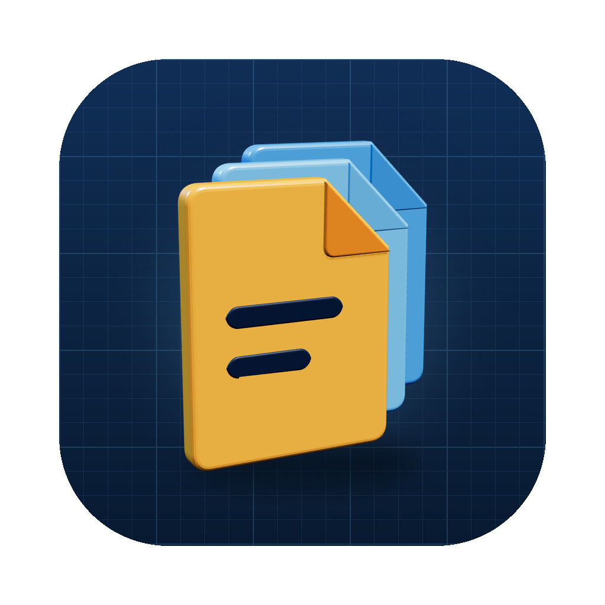
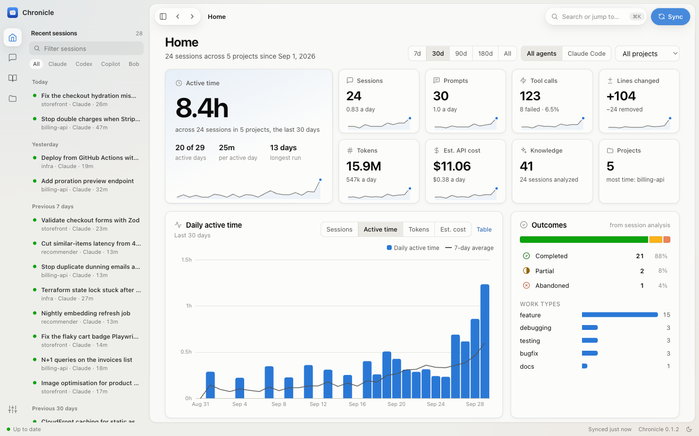
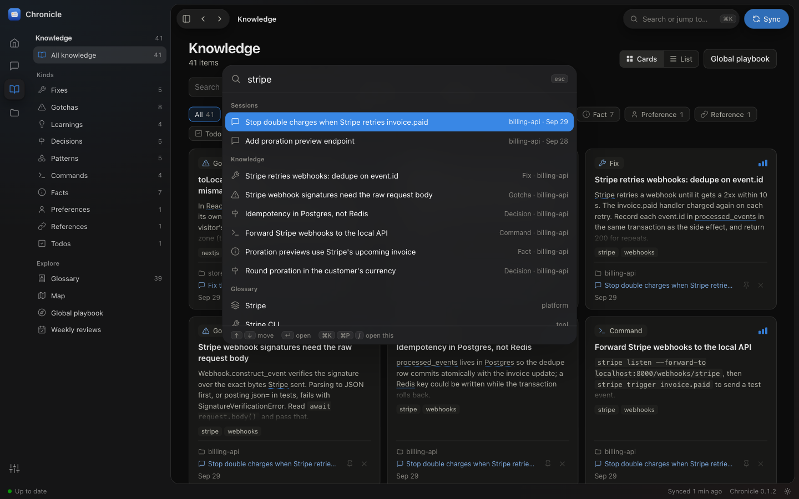
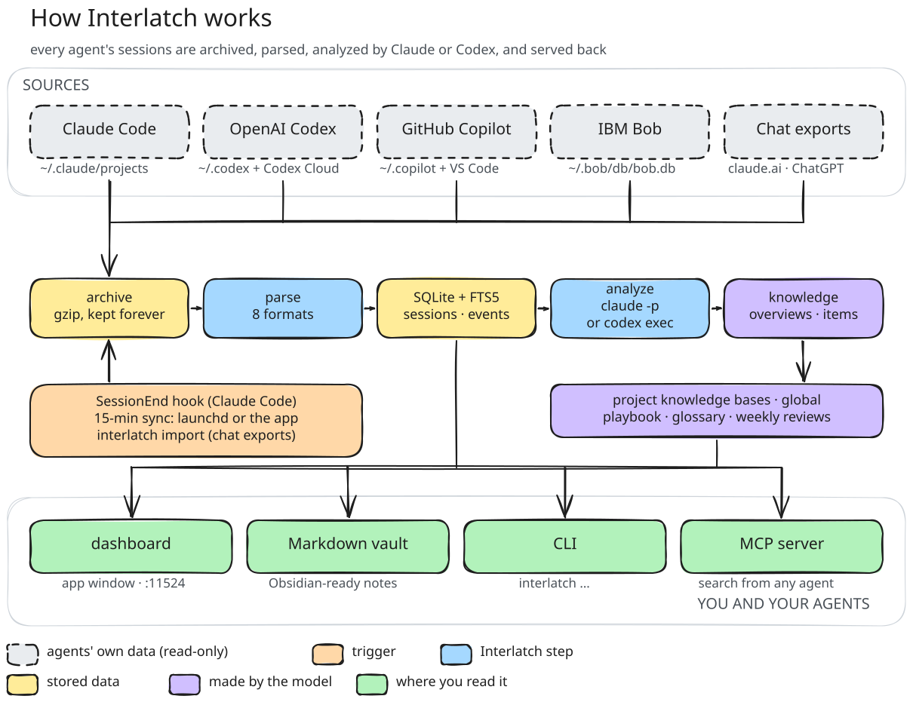

<p align="center"></p>

<h1 align="center">Chronicle</h1>

<p align="center"><b>A searchable memory of every coding-agent session you run.</b><br>
Claude Code, Codex, GitHub Copilot and IBM Bob sessions, archived and turned into knowledge on your own machine.</p>

<p align="center">
  <a href="https://pypi.org/project/agents-chronicle/"></a>
  
  
  <a href="LICENSE"></a>
</p>

<p align="center"><a href="#quick-start">Quick start</a> · <a href="docs/README.md">Docs</a> · <a href="CHANGELOG.md">Changelog</a> · <a href="README.ja.md">日本語</a></p>

Your coding agents solve problems all day, and then the lesson disappears: Claude Code deletes transcripts after 30
days, and nothing carries a fix from one session to the next. Chronicle keeps every session, uses Claude Code itself
to pull out what was learned, and gives it back to you in a dashboard and to your agents through an MCP server.


## What it gives you

Chronicle reads each finished session and writes down what is worth keeping. A real example, taken word for word
from the [demo data](docs/development.md#demo-data):

> **Gotcha** · billing-api<br>
> **Stripe webhook signatures need the raw request body**<br>
> `Webhook.construct_event` verifies the signature over the exact bytes Stripe sent. Parsing to JSON first, or
> posting `json=` in tests, fails with `SignatureVerificationError`. Read `await request.body()` and pass that.<br>
> <sub>From the session "Stop double charges when Stripe retries invoice.paid", extracted automatically.</sub>

- **Every session, kept for good.** Raw transcripts are archived, so nothing is lost when an agent cleans up.
- **Knowledge, extracted automatically.** Fixes, gotchas, decisions, commands, project facts and preferences, merged
  into a knowledge base per project and a playbook across all of them.
- **Your agents can ask.** Through the MCP server, an agent can search your past sessions: *"have we hit this
  error before?"*, *"why did we put idempotency in Postgres?"*
- **A dashboard to browse it all.** Sessions with their full transcripts, statistics, a glossary of your own
  vocabulary drawn as a mindmap, and a weekly review Claude writes for you. ⌘K jumps anywhere.
- **Plain files too.** An Obsidian-compatible Markdown vault and a `chronicle` CLI.

## Quick start

You need macOS 13 or later and a logged-in [Claude Code](https://claude.com/claude-code), which does the analysis.

1. **Install.** Either download the desktop app from the
   [latest release](https://github.com/kayeungadrian-tam/agents-chronicle/releases/latest) (Apple silicon), open it
   and choose **Connect**, or use the command line:

   ```bash
   uv tool install --python 3.13 agents-chronicle
   chronicle install        # session-end hook, background sync, dashboard, MCP server
   ```

2. **Use your agents as usual.** Each session is recorded when it ends and analyzed in the background.

3. **Explore.** Open the app, or the dashboard at <http://127.0.0.1:8765/>, and press **⌘K**. Or ask your agent
   what it learned last week.

To record Codex, GitHub Copilot or IBM Bob too, connect them from **Settings › Sources** or with
`chronicle connect codex`. [Install](docs/install.md) covers everything each option sets up, and how to remove it.

## Supported agents

| Agent | Recorded from | Picked up | Search from the agent (MCP) |
| --- | --- | --- | --- |
| Claude Code | `~/.claude/projects` transcripts | as each session ends, plus every 15 min | ✅ |
| Codex (opt-in) | `~/.codex/sessions` rollouts | every 15 min, once idle | ✅ |
| GitHub Copilot (opt-in) | Copilot CLI and agent sessions; Copilot Chat logs in VS Code | every 15 min | ✅ VS Code and Copilot CLI |
| IBM Bob (opt-in) | `~/.bob/db/bob.db`, read-only | every 15 min | ✅ |

Every agent's sessions share the same dashboard, knowledge, glossary and MCP tools; the analysis always runs through
Claude Code. Codex also brings back Claude Code sessions that Codex Desktop imported after Claude Code deleted them.
[Sources](docs/sources.md) has the details for each.

## A closer look

| | | |
| --- | --- | --- |
|  |  |  |
| **Home.** Active time, sessions, tokens and estimated cost, day by day. | **Map.** Your glossary as a mindmap; each term opens into the knowledge and sessions behind it. | **⌘K.** One search over sessions, knowledge, projects, terms and commands. |

The screenshots come from made-up demo data, and you can build it yourself:
`uv run python docs/demo/make_demo.py /tmp/chronicle-demo`.

## How it works



1. A hook (or the 15-minute sync) hands each finished session to Chronicle, which archives the raw transcript and
   parses it: prompts, replies, tool calls, files, tokens and cost.
2. Once the session is idle, a condensed digest with secrets redacted goes to `claude -p`, which returns a summary
   and knowledge items. The call runs sandboxed: no tools, hooks or MCP servers.
3. New knowledge is merged into the project's knowledge base, the glossary is refreshed, and each finished week
   gets a written review.
4. Everything is served to you (dashboard, app, vault, CLI) and to your agents (MCP).

**What leaves your machine:** only that redacted digest, sent to Claude through your own Claude Code login. No
telemetry, nothing sent to anyone else. [Data and privacy](docs/privacy.md) lists what is stored where.

**What it costs:** analysis draws from your Claude plan like any other Claude Code use. In API terms it averages
about $0.38 per session with Sonnet; `chronicle analyze --pending --dry-run` sizes a backlog before you spend
anything. [How analysis works](docs/analysis.md#how-analysis-works) has the details.

## FAQ

**Will it slow down my agent?** No. The session-end hook hands off to a detached process and returns in
milliseconds; analysis runs later in the background.

**Does it work without Claude Code?** Recording and browsing work for every connected agent. Summaries and
knowledge need a logged-in `claude`; without one, sessions are archived and wait in the analysis queue.

**Windows or Linux?** Not yet. The app and the background agents are macOS only.

**Can I keep a project or a session out?** Add the project to `sources.exclude_projects` in the
[configuration](docs/configuration.md), or remove a session for good with `chronicle forget <id>`.

**How do I remove it?** `chronicle uninstall` removes the hooks, background agents and MCP registrations and keeps
your data; add `--purge` to delete the data too.

Something not working? See [Troubleshooting](docs/troubleshooting.md).

## Documentation

[Install](docs/install.md) · [Sources](docs/sources.md) · [Dashboard, glossary and Map](docs/dashboard.md) ·
[Command line](docs/cli.md) · [What gets recorded and how analysis works](docs/analysis.md) ·
[Configuration](docs/configuration.md) · [Data and privacy](docs/privacy.md) ·
[Troubleshooting](docs/troubleshooting.md) · [Development](docs/development.md)

## Contributing

Issues and pull requests are welcome. [CONTRIBUTING.md](CONTRIBUTING.md) explains how to run the tests and work on
the dashboard with demo data instead of your own sessions.

## License

[MIT](LICENSE)
