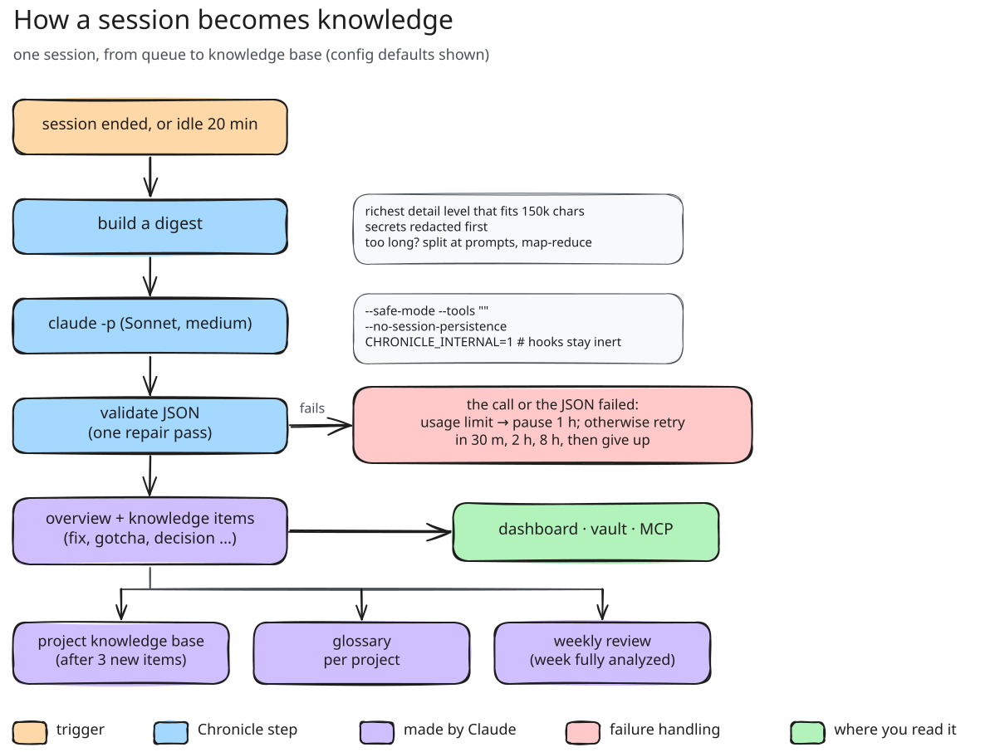

# 記録される内容と分析の仕組み

[← Chronicle](../../README.ja.md) · [ドキュメント一覧](README.md)

## すべてのセッションで記録される内容

セッションごと：プロジェクト、ブランチ、Claude Code のバージョン、開始／終了、経過時間と実稼働時間（15 分を超えるアイドル時間は除外）、
人間のプロンプト（Claude の作業中にキューに入れたものを含む）、スラッシュコマンド、中断、コンパクション、所要時間と成否付きのすべての
ツール呼び出し、行数付きの読み込み・編集ファイル、固有の使用量を持つサブエージェントとワークフロー、スキル、MCP サーバー、フック、
PR と成果物、そして API 呼び出しごとのトークン使用量（メッセージ単位で重複除去）と API 定価による費用の見積もり。見積もりは、
単一プロセスのセッションでは Claude Code 自身の `cost-state` とセント単位で一致します。サブスクリプションの請求とは異なります。

分析済みのセッションごと：タイトル、要約、目的、結果、作業の種類、タグ、ハイライト、未解決の事項、つまずき、雰囲気、そしてナレッジ項目：

| 種類 | 意味 |
| --- | --- |
| fix | 失敗、その根本原因、修正方法 |
| gotcha | 落とし穴と、その避け方 |
| learning | 技術やコードベースについての気づき |
| decision | 設計上の判断と、その理由 |
| pattern | 再利用できる手法やスニペット |
| command | 役立つコマンドの使い方 |
| fact | プロジェクトの構成、設定、エンドポイント、デプロイ |
| preference | Claude にどう作業してほしいか |
| reference | 外部への参照 |
| todo | 後で対応すること |

Claude 自身の自動メモリーノート（`projects/*/memory/*.md`）と Codex のメモリーノートも、ナレッジとして取り込まれます。

Codex、Copilot、Bob、Antigravity のセッションも、ログにデータがある範囲で同じ項目を埋めます。たとえば Copilot Chat のログにはキャッシュの内訳がない
（そのため費用の見積もりもない）、Bob のタスクには呼び出しごとの所要時間がない、Antigravity の Gemini モデルには料金がない、といった違いがあります。

## 分析の仕組み



1. セッションは、終了した時点（フック）か、`idle_minutes` の間アイドルになった時点でキューに入ります。
2. トランスクリプトは、`chunk_chars` に収まる範囲で最も詳しいレベルの要約にまとめられます（プロンプトと応答の全文、ツール呼び出しは 1 行ずつ、
   エラーの抜粋、サブエージェントの報告）。非常に長いセッションはプロンプトの境界で分割し、map-reduce で処理します。機密情報は最初に伏せ字にします。
3. ダイジェストは `analysis.backend` で選んだエージェントに、あなた自身のログインを通じて送られます。サンドボックス内で動くので、
   分析そのもののセッションは書き出されず、あなたのフック・プラグイン・MCP サーバー・指示ファイルは読み込まれず、
   モデルは回答することしかできません：
   - **Claude Code**（`backend = "claude"`、既定）：`claude -p --no-session-persistence --safe-mode
     --tools "" --strict-mcp-config`。
   - **Codex**（`backend = "codex"`）：`codex exec --ephemeral --ignore-user-config --sandbox read-only`。
     ツール機能（シェル、コード実行、サブエージェント、アプリ、プラグイン、Web 検索、画像）をすべて切り、フック、`AGENTS.md`、
     スキルの指示も切り、Codex 自身の指示の代わりに Chronicle の指示を使います。Codex はすべてのツールをフラグで切れるわけでは
     ないため、Chronicle はイベントストリームも読みます：ツール呼び出しのあとに来た応答は捨てられ、その分析は失敗として扱われます。
   - **IBM Bob**（`backend = "bob"`）：Bob Shell の `bob run --format stream-json --max-turns 1 --disable-mcp
     --disable-subagents`。ツールグループをすべて無効にし、Chronicle の指示だけを持つツールなしのカスタムモードを置いた使い捨ての
     ワークスペースで実行します。Codex と同じく、ツール呼び出しのあとに来た応答は捨てます。ヘッドレス実行には Bob の API キーが
     必要です（アプリのサインインは使われません）：`chronicle config set-key bob`、**Status › Analysis** の IBM Bob タブ、
     または `BOB_API_KEY`。モデルは Bob が選びます。Bob は各分析を自身のタスク一覧に残しますが、Chronicle はそれをセッションとして
     取り込みません。

   - **モデルプロバイダーの API**（`backend = "anthropic"`、`"bedrock"`、`"openai"`、`"azure"`、`"openrouter"`、
     `"ollama"`、`"openai-compatible"`）：呼び出しごとに素の HTTP リクエストを 1 回送ります。ツールは含まないので、モデルは
     答えることしかできません。[モデルプロバイダー](#モデルプロバイダー)を参照してください。

   **Status › Analysis** の各エージェントのタブでモデルを設定できます。Claude Code では、セッション用（`analysis.model`）、
   ナレッジベース用（`synthesis.model`）、取り込んだチャットの選別用（`analysis.screen_model`）を、エイリアス（`sonnet`、
   `opus`、`haiku`、`fable`）か `claude-opus-5-5` のような完全なモデル ID で指定します。Codex では `analysis.codex_model`
   （空なら Codex の既定）。どちらも `analysis.effort` を共有します。

   これらの実行中は `CHRONICLE_INTERNAL=1` によって Chronicle 自身のフックが無効になります。**Status › Analysis**、
   `chronicle config set analysis.backend codex`、または 1 回の実行だけなら `chronicle analyze --backend codex` で
   切り替えられます。
4. JSON の応答は寛容に検証され（修復は 1 回まで）、保存されます。プロジェクトに `min_new_items` 件の新しい項目がたまると、
   そのプロジェクトのナレッジベースが再統合され、古くなった項目、矛盾する項目、重複した項目は *superseded*（置き換え済み）になり、
   それぞれ置き換えた項目を記録します（ピン留めした項目とメモリー項目は置き換えられません）。重複は裏付けとしても数えられます：
   [ナレッジの信頼度](#ナレッジの信頼度)を参照してください。終わった週のセッションがすべて分析されると、モデルがその週の振り返り
   （3 行の要約、テーマ、成果、学び、未解決の事項、繰り返し起きたつまずき、作業の進め方への具体的な提案）を書きます。
   ナレッジベース、プレイブック、振り返りは流し読みできるように書かれます：3 行の要約、短い概要、ナレッジベースの各項目の見出し、
   すべての項目への字数の上限。振り返りの数値とグラフはモデルではなくデータベースから作られます。
5. 使用量の上限や認証のエラーが出ると、分析を 1 時間停止します。その他の失敗は 30 分 → 2 時間 → 8 時間と間隔を空けて再試行します。
   呼び出しには実時間の期限があり、Mac のスリープで止まった呼び出しは復帰直後に強制終了され、失敗としては数えずにキューに戻されます。
   分析後に続きが行われたセッションは、再び分析されます。
   まだ分析されていないセッションは、必ずその理由を示します：セッションのページ、**Status › Analysis**（理由ごとの件数）、
   `chronicle status` で確認できます。*待機中*の理由は自然に解消します（次の実行で分析、まだ作業中、再試行待ち）。*保留*の理由は
   何かを変えるまで解消しません（除外したプロジェクト、プロンプトが少なすぎる、インストール前のセッションで backfill がオフ、4 回失敗）。
   キュー全体が止まっているとき（使用量の上限による一時停止、自動分析がオフ、分析用の CLI が見つからない）も、そのことを示します。

## 言語

`[analysis] language` が `ja` なら（[設定](configuration.md#analysis)、または **Status › Analysis**）、Chronicle は日本語で
書きます。要約、ナレッジ、ナレッジベース、プレイブック、用語集の定義とテーマ名、週次の振り返り、選別の理由です。識別子、
コマンド、パス、エラーメッセージ、引用は元のまま残し、タグと Chronicle が読み返すコード（種類、結果、判定など）も英語の
ままです。設定は、変更したあとに分析や再統合をするものから反映されます。それまでのセッションは、再分析するまで元の言語の
ままです。再統合では、言語が違っても同じ教訓を述べた項目を重複として扱うため、まとめられて互いの裏付けになります。
ダッシュボード自体の表示は、この設定とは別に、ダッシュボードでブラウザーごとに選んだ言語に従います。

## ナレッジの信頼度

ナレッジの各項目には、どこまで裏付けられたかを示す段階（stage）があります：

| 段階 | 表示 | 条件 |
| --- | --- | --- |
| `wip` | tentative | 1 セッションのみで、分析の確信度が低い |
| `provisional` | seen once | 1 セッションのみ |
| `established` | established ×N | 同じ教訓が 2 セッション以上で見つかった。Claude Code と Codex のメモリーノート、手動で追加した項目もここから |
| `canonical` | canonical ×N | 同じ教訓が 14 日以上にわたる 3 セッション以上で見つかった、またはピン留めした |

裏付けは再統合から得られます。あるセッションの項目が別のセッションの項目と同じ教訓だと判断されると、その組は重複として報告され、
残る項目がもう一方のセッションを引き継ぎます。段階はモデルの判断ではなく、そのセッションと日付から計算され、理由も一緒に保存されます
（「confirmed in 3 sessions over 19 days (2026-09-01 → 2026-09-20)」）。関連するだけの項目は別々のまま残り、プロジェクト横断の
プレイブックは何も退役させずに裏付けだけを合算します。セッションを再分析しても、項目が得た裏付けは保たれます。

段階はナレッジが読まれるすべての場所で使われます：検索と SessionStart の要約は信頼度の高い順に並び、MCP ツールは各項目に段階を
表示し（`[gotcha · established ×3]`）、ナレッジベースの各項目には最も信頼度の高い出典の段階が付き、再統合では各項目の段階が
モデルに渡されます。段階から外れるのは状態（status）の変化です：置き換えられた項目は段階を保ったまま後継の項目を記録し、
established や canonical の項目が（単なる重複の統合ではなく）新しい項目に覆されると、その週の振り返りの **Overturned** に載ります。

## 事件簿

修正・落とし穴・決定は、調べるためだけでなく学ぶためにも、事件簿（ケースファイル）として残ります。分析はそれぞれについて次を記録します：

- **現場:** 何をしていて、原因が分かる前に最初に何が見えたか。決定の場合は、決めなければならなかった問題。
- その状況から生まれた **問い** と、数語の **答え**。
- **外れた手がかり:** セッションで試して違うと分かったもの、それぞれ何で違うと分かったか。決定の場合は、採らなかった選択肢。
  トランスクリプトにある行き止まりだけで、分析には決して作り上げないよう指示しています。

**ナレッジ › すべてのナレッジ** では、まだ答えていない事件は現場と問いから始まります。選択肢は本当の答えと、外れた手がかりのうち
最大 2 つです。1 つ選ぶと正解かどうかが表示され、外れた手がかりを選んだ場合は何で外れたかも示され、そのあとに教訓が表示されます。
外れた手がかりがない事件は、まず自分の答えを考えるよう促します。**スキップして答えを見る** でいつでもすぐに開け、5 問続けて
スキップすると、**先に問う** を再びオンにするまで事件は答えから表示されます。検索結果、セッションページ、リスト表示では最初から
答えが表示されます。フィルター行とナレッジのページにある **事件簿** で、事件だけを一覧できます。回答はそのブラウザーにだけ
残り、アーカイブに保存されることも、ハブに送られることもありません。

エージェントにも現場と外れた手がかりが渡ります。MCP ツールは各教訓の下にそれらを表示するので、エージェントは症状に気づき、
行き止まりを避けられます。ハブは、コンピューターが共有した教訓の事件簿を保持します。メンバーに送り返されるチームメイトの
教訓には、まだ含まれません。

以前のバージョンで分析された教訓は事件簿に載っていません。セッションを再分析すると（`chronicle analyze <session>`）、
その教訓が事件簿に載ります。再分析は、ほかの分析と同じく分析用のログインを使います。

## モデルプロバイダー

コーディングエージェントの代わりに、あなた自身のキーでモデルプロバイダーの API を呼んで分析することもできます。**Status ›
Analysis** で **API provider** を選び、プロバイダーを選んでモデル（既定がない場合はエンドポイントも）を入力し、キーを追加してから
**Test connection**、**Use for analysis** を押します。ターミナルからは：

```sh
chronicle config set providers.openai.model gpt-5.5
chronicle config set-key openai            # キーを尋ねます。シェルの履歴には残りません
chronicle config set analysis.backend openai
```

| プロバイダー | `backend` | エンドポイント | サインイン |
| --- | --- | --- | --- |
| Anthropic | `anthropic` | `https://api.anthropic.com` | API キー（`ANTHROPIC_API_KEY`） |
| Claude in Amazon Bedrock | `bedrock` | `region` から `https://bedrock-mantle.<region>.api.aws/anthropic` | Bedrock の API キー（`AWS_BEARER_TOKEN_BEDROCK`）、または AWS の認証情報：環境変数のキーか、`aws configure export-credentials` が解決するもの（SSO、ロール、`profile`）で SigV4 署名 |
| OpenAI | `openai` | `https://api.openai.com/v1` | API キー（`OPENAI_API_KEY`） |
| Azure OpenAI | `azure` | `resource` から `https://<resource>.openai.azure.com/openai/v1` | API キー（`AZURE_OPENAI_API_KEY`）、または `az login` による Microsoft Entra ID |
| OpenRouter | `openrouter` | `https://openrouter.ai/api/v1` | API キー（`OPENROUTER_API_KEY`） |
| Ollama | `ollama` | `http://localhost:11434`（または `OLLAMA_HOST`） | 不要：モデルはあなたのコンピューターで動き、何も外に出ません |
| Chat Completions 互換のサーバー | `openai-compatible` | 任意。LM Studio、vLLM、Groq、Gemini の OpenAI 互換エンドポイントなど | キーは任意 |

- **モデル。** `model` が分析とナレッジベースの作成を、`small_model` が取り込んだチャットの選別を受け持ちます（既定は
  `model`）。Chronicle の設定にある Claude のモデル名（`sonnet`、`haiku`）は、プロバイダーでは `model` と `small_model` を
  指します。Anthropic と Bedrock の既定は Claude Sonnet 5.5 と Claude Haiku 4.5 で、それ以外はモデルの指定が必要です。Azure
  ではデプロイ名がモデルです。
- **キー**は Chronicle のフォルダーの `provider-keys.json` に保存され、あなたのユーザーだけが読めます。`config.toml` には
  入りません。保存したキーは環境変数より優先されるので、ダッシュボード（launchd がシェルの変数なしで起動します）と CLI が
  同じキーを使います。ダッシュボードはキーを表示し返すことはなく、キーとエンドポイントを変えられるのはそのコンピューター自身
  （またはハブの管理者）だけです。
- **ローカルモデル（Ollama）。** Chronicle は Ollama 自身の `/api/chat` を `num_ctx`（既定 32,768 トークン）付きで呼び、
  1 回あたり 60,000 文字のトランスクリプトを送ります（`chunk_chars`）。プロンプトがコンテキストを埋めた場合は、黙って切らずに
  エラーにします。教訓の質はモデル次第です。1B のモデルでは薄く一般的なものになるので、コンピューターで無理なく動く最大の
  モデルを選んでください。
- **出力。** OpenAI 形式のプロバイダーには JSON オブジェクトを求めます（`json_mode`。対応しないサーバーもあるため
  `openai-compatible` では既定でオフ）。出力上限で切れた応答は `max_output_tokens` を示すエラーになります。Anthropic と
  Bedrock の呼び出しは `effort` を送り、既定で 32,000 トークンまで出力できます。

プロバイダーを使う場合の費用は、API が報告する額（OpenRouter）か、トークン数から Anthropic や OpenAI の定価で見積もった額
（Anthropic、Bedrock、OpenAI）です。Azure、Ollama、その他のサーバーはトークン数だけを表示します。それ以外では、
分析はあなた自身の Claude Code または Codex のログイン、または Bob の API キー（Bob は分析ごとの費用を報告します）を通じて行われます。Claude の場合、表示される費用は API 定価に換算した
金額です。Sonnet ではセッションあたり平均約 $0.38 でした（要約の平均は約 15 万文字）。`max_budget_usd` で 1 回の呼び出しの上限を
設定できます。Codex はトークン数を報告しますが価格は報告しないため、Codex による分析には費用が表示されません。Claude や ChatGPT の
サブスクリプションでは、請求ではなくプランの使用枠から消費されます。`chronicle analyze --pending --dry-run` で、使う前に未分析分の
規模を確認できます。
