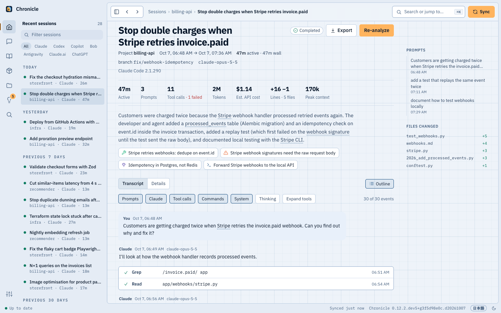
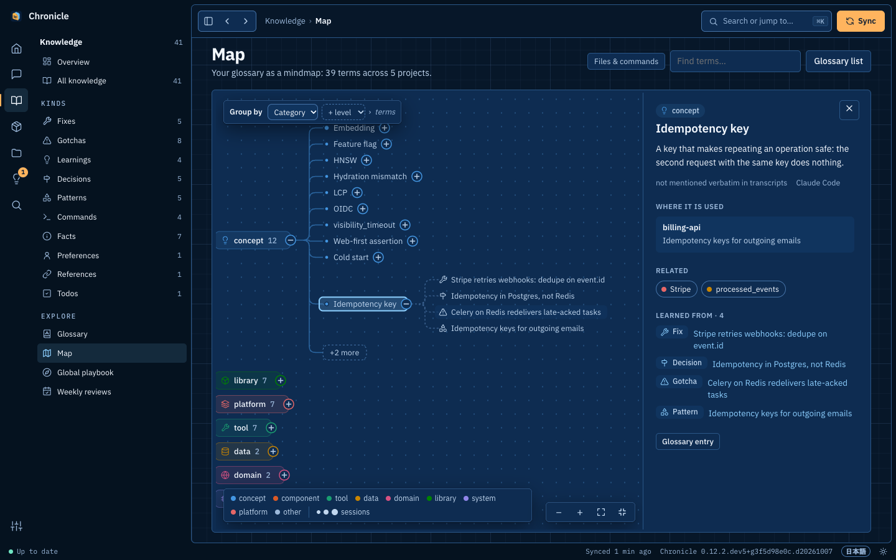

# ダッシュボード、用語集、マップ

[← Chronicle](../../README.ja.md) · [ドキュメント一覧](README.md)

**ダッシュボード：** VS Code を簡素にしたレイアウトを、[chronicle.chatixia.net](https://chronicle.chatixia.net/) と同じブループリントのスタイルで
（ダークテーマは紺の青図、ライトテーマは白地の青図、書体は IBM Plex）。左端のアイコンレールで
**ホーム**、**セッション**、**ナレッジ**、**プロジェクト**、**提案**、**設定**を切り替え（アイコンにポインターを置くか Tab で移ると、名前と中身が出ます）、その横のサイドバーにそのセクションの一覧が出ます
（最後に動いた日ごとの最近のセッションとエージェントの絞り込み、件数付きのナレッジの種類と用語集・マップ・グローバルプレイブック・週次の振り返り、
プロジェクト、状態ごとの提案と「うまくいかないこと」、または状態・ソース・MCP・デバイス・外観）。**⌘K**（⌘P や `/` でも可）で開くパレットから、任意のセッション、ナレッジ、プロジェクト、
用語、ページに移動したり、コマンド（同期、用語集の再構築、テーマのグループ化、テーマの切り替え）を実行したりできます。**⌘B** で
サイドバーを隠せます。ステータスバーにはバックグラウンドの処理、分析待ちの件数、最後の同期、見つかったアップデート（[アップデート](install.md#アップデート)）が出ます。**Settings › Appearance** で
テーマと言語を選べます。フォントは Chronicle に同梱しているので、ダッシュボードが外部のフォントサービスに接続することはありません。**Settings › Devices** には、
このコンピューターがハブか、ハブに送る側か（送る側なら参加しているハブのプロジェクトも。参加・脱退・再参加ができます）、
スマートフォンでダッシュボードを開く方法が表示されます。スマートフォンではレールが
画面下のタブバーになり、ページが画面の幅いっぱいに広がります。ホーム画面に追加してアプリのように開くこともできます
（[スマートフォンとほかのコンピューター](devices.md)）。

## キーボードショートカット

| キー | |
| --- | --- |
| ⌘K、⌘P または `/` | 任意のセッション、ナレッジ、プロジェクト、用語、ページを検索または移動。コマンドを実行 |
| ↑ ↓、↵、Esc | パレットの結果を移動、1 つを開く、パレットを閉じる |
| ⌘B | サイドバーの表示／非表示 |
| Esc | パレットを閉じる。幅の狭いウインドウではサイドバーを閉じる |

macOS 以外では ⌘ の代わりに Ctrl を使います。macOS アプリでは、ツールバーをドラッグしてウインドウを動かし、ツールバーをダブルクリックすると拡大／縮小します。

## ページ

ページ：ホーム（稼働時間の見出しと稼働日数・最長連続日数、スパークライン付きの統計タイル（比較できる前の期間がそろうまでは
1 日あたりの値）、7 日平均付きの日次グラフ、結果の内訳、連続記録付きのアクティビティカレンダー、最も忙しい時間帯、プロジェクト、
失敗した呼び出しを含むツール、モデル、エージェント）、並べ替え・絞り込みできるセッション一覧、12 週間の活動を示すプロジェクトカード（[自分で作るグループ](#プロジェクトのグループ)ごと）、[システムマップ](#システムマップ)、
セッションページ（上部に主要な数値、要約、そこから得られたナレッジ。その下で**詳細**（目的、ハイライト、未解決の事項、ナレッジ、コンパクションを含む
コンテキストウインドウのグラフ、ツール、ファイル、サブエージェント、そのセッションが作った[成果物](#成果物)。セッションを開くと最初に表示）と**トランスクリプト**
（入力と出力を開ける 1 行のツール呼び出しとサブエージェントのスレッドを含む会話。検索結果から開くとこちら）を切り替えます。幅の広いウインドウでは、プロンプト、
作ったもの、変更したファイルの**アウトライン**がトランスクリプトの横に並び、スクロールに追従します）、ナレッジの概要（マップ、すべてのナレッジ、
用語集、週次の振り返りのカードに、それぞれの中身の要点を表示）、ナレッジブラウザー（ピン留め／却下。各項目に[段階](analysis.md#ナレッジの信頼度)を表示し、表は段階で並べ替え可能。修正・落とし穴・決定は、答えの前に問いかける[事件簿](analysis.md#事件簿)として表示）、
プロジェクトのナレッジベースとグローバルプレイブック（3 行の要約、セクションへのチップ、絞り込み、詳細と出典を開ける短い項目のカードに
まとめたセクション。established と canonical の項目には印が付きます。プロジェクトのものは[アーキテクチャ図](#アーキテクチャ図)から始まります）、用語集、用語集のマインドマップ（後述の「マップ」）、週次の振り返り（1 週ずつ表示：
3 行の要約、前の週と比べた数値、日ごとの稼働時間、時間の使い道、結果と得られたナレッジ、続いてテーマと、出荷したもの・学んだこと・
未解決の事項・足を引っ張ったもの・次に試すこと・覆された信頼済みのナレッジの短い一覧。全文は折りたたんであります）、
**Search all sessions**（レールの虫眼鏡、または ⌘K で入力したときの最後の項目）：語句に言及したすべてのセッションを、言及の多い順（または新しい順・古い順）に表示し、
各セッションの言及箇所をトランスクリプト順にハイライトして並べます。**Show all** ですべての言及を表示でき、言及をクリックすると
その位置のトランスクリプトが語句をハイライトしたまま開きます。用語集の用語は、表示される場所（トランスクリプト、ナレッジ、要約）ではどこでも下線付きになり、
ホバーで定義、クリックで項目を表示します。すべてのグラフに表形式の表示があり、ライトとダークのテーマに対応しています。

## プロジェクトのグループ

関連するプロジェクトを、Aktio のリポジトリをまとめた **Aktio** のように 1 つの見出しの下に置けます（プロジェクトページとそのサイドバー）。
グループは 1 階層だけで、変わるのはプロジェクトの並び方だけです。各プロジェクトのセッション、ナレッジベース、ハブでの共有はそのままです。

- **作る：** プロジェクトページの **New group**、またはプロジェクトのグループメニュー（カードのフォルダーのボタン、一覧では行の末尾）の
  **New group…**。入れるプロジェクトにチェックを付けると、それらが共有するフォルダーをフォルダーのルールとして提案し（コンピューターごとに 1 つ。
  `~/Projects/Work/AI-BPO/Aktio` と `aktio-vm:/root/Aktio` の両方など）、その名前をグループ名にします。保存の前にルールを外したり、自分で追加したりできます。
- **フォルダーのルール：** ルールのフォルダーの下にあるプロジェクトは、あとから始めたものも含めてグループに入ります。2 つのグループのルールが
  同じプロジェクトにかかるときは、長い（より具体的な）フォルダーのほうが優先されます。
- **手で移す：** プロジェクトのグループメニューで別のグループ、または **No group** に移せます。手で移したものはフォルダーのルールより優先され、
  フォルダーどおりのグループに戻すと再びルールに従います。チャット（claude.ai、ChatGPT）にはフォルダーがないので、手で入れます。
- グループの見出しの **Edit** で、名前、ルール、プロジェクトの変更や削除ができます。グループを削除してもプロジェクトは残り、
  ほかのグループのルールどおりの場所に戻ります。
- グループはページでもサイドバーでも折りたため、そのブラウザーでは折りたたんだままになります。**Sessions** のプロジェクトの絞り込みでは
  プロジェクトがグループごとに並び、**All of *グループ*** でグループのすべてのセッションを表示できます。プロジェクトのページでは、パンくずリストにグループが出ます。

グループはこのコンピューターのアーカイブに保存され、ハブには送られません。人を登録したハブでは管理者がハブのグループを見て変更でき、
一部のプロジェクトだけを見られる人にはグループは表示されません。ハブに送っているコンピューターでは、グループ全体をハブの 1 つの
プロジェクトとして共有できます（[グループをハブの 1 つのプロジェクトにする](devices.md#グループをハブの-1-つのプロジェクトにする)）。

## 提案と「うまくいかないこと」

**Suggestions**（提案。レールの電球のアイコンで、バッジはまだ見ていない提案の数）は、Chronicle が提案する修正の一覧です。
`CLAUDE.md` や `AGENTS.md` に書く行、`~/.claude.json` の Playwright MCP サーバーの変更、あなたが実行するセットアップ手順が
あります。状態のスイッチで **To review**、**Applied**、**Done**、**Stale**、**Dismissed** を切り替え、メニューでユーザーレベルの
提案か 1 つのプロジェクトに絞り込めます。カードは変更するファイルごとにまとまり、根拠（「seen in 31 sessions across 17
projects · still happening · last 2026-10-01」）、例のセッション、警告（公開リポジトリ、機密情報の可能性、git で管理されて
いないファイル）、編集できる行を表示します。**Preview** で差分を表示し、**Apply** で書き込み（事前にファイルをバックアップ）、
**Dismiss** で二度と提案しないようにします。適用済みのカードには **Undo** があります。**Move to every project** で
プロジェクトの行をユーザーレベルのファイルに移し、ユーザーレベルのカードは元のプロジェクトに戻せます（[行を移す](suggestions.md#行を移す)）。セットアップ手順はコマンドと **Copy**、
**Mark done** を表示し、Chronicle が実行することはありません。**Check again** で最新のセッションを今すぐ確認します。確認待ちが
あるときは、**ホーム**に上位 3 件が **Approve** と **Dismiss** 付きで出ます。

**What goes wrong**（うまくいかないこと）は、セッションで繰り返し起きる失敗を、30 日・90 日・180 日・全期間とプロジェクトで
絞り込んで一覧にします。影響したセッション数とプロジェクト数、12 週間の推移、最後に見た日とまだ起きているか、その提案への
リンクが出ます。原因をクリックすると例と修正が出ます。その下に失敗の多いツールと、想定内の失敗（開発ループの中で失敗する
テスト、提供元の障害など）をたたんだ **Noise** カードがあります。[提案と「うまくいかないこと」](suggestions.md)を参照してください。

## 成果物

**Artifacts**（レールの箱のアイコン）は、エージェントが作ったものの一覧です：ドキュメント、HTML ページ、図、スライド、
スプレッドシート、生成した画像、公開したリンク（claude.ai の Artifact、Claude のドキュメント、Google ドライブのファイル、
Slack のキャンバス）、プルリクエスト、コミット。どれもトランスクリプトの明示的な記録から取り出し、ディスクを走査して推測することはしません：

- エージェントが新しく作った、または丸ごと書いたファイルで、成果物にあたるもの（既存ファイルの編集は含みません）：Markdown、HTML、
  SVG などの図の形式、Office ファイル、PDF、CSV、画像。コード、エージェントの設定とメモリ（`CLAUDE.md`、`AGENTS.md`、`~/.claude`）、
  依存パッケージとビルドの出力、ソースフォルダー内のアプリ自身のページ・アイコン・テンプレートは除きます。
- スクリプト（python-pptx や変換ツール）が保存したスライド、文書、スプレッドシート、PDF：セッションのコマンドやその出力に
  パスが現れ、そのファイルがセッションの間に作られたもの（読んだだけのファイルはその前からあります）。`~/Library` とシステムの
  一時フォルダーのファイルは除きます。
- Claude Code の **Artifact** ツールで公開したページ、Claude のドキュメント、Google ドライブのファイル、Slack のキャンバス。
- `gh pr create` や GitHub のツールで作ったプルリクエスト、または Claude Code 自身の PR の記録。
- コミット：git の `[branch sha] subject` の行、静かなコミットのあとの `git log --oneline`、ハッシュを出さなかった静かなコミットのメッセージ。
- Codex の画像生成ツールが作った画像。
- claude.ai のチャットでは、その Artifact（更新のたびに 1 版）と、渡したファイル（`present_files`）。

同じファイル・リンク・コミットはセッションをまたいで 1 項目にまとめ、版の数と作ったセッションの数を示します。各行には今の状態が出ます：
書いたときのまま**ディスク上**、**その後に変更**、**なし**（書いた内容はセッションのトランスクリプトに残っています）、claude.ai の
ものは**チャット内**、またはリンク。種類・プロジェクト・語句で絞り込み、なくなったものを隠し、ファイルのパスをコピーし、作った
ツール呼び出しの位置でセッションを開けます。**Open**（またはタイトルのクリック）はファイルを新しいタブで表示します：ディスク上のものは
今の内容を、なくなったものはエージェントが書いたときの内容を、保管したトランスクリプトから復元して表示します（Claude Code や Codex
が丸ごと書いたファイル）。HTML ページは自分のスクリプトを動かしますが、サンドボックスの中なので Chronicle のデータや API には
届きません。Markdown と CSV はテキストとして、PDF はブラウザーで表示し、Office ファイルはダウンロードします。**⋯** メニューでは、
ディスク上のファイルを専用のアプリで開き（**Open on this Mac**：スライドは Keynote や PowerPoint、Markdown はエディター）、
Finder で表示し、パスをコピーできます。この 2 つは Chronicle が動いているコンピューター上のブラウザーにだけ表示され、Tailscale
経由でほかのデバイスから使うことはできません。ディスク上に残っている画像と SVG の図にはサムネイルが付き、Mac ではスライド、文書、スプレッドシート、PDF にも
（Quick Look が描く 1 ページ目の）サムネイルが付きます。**Images**、**Diagrams**、**Decks** ではグリッドで並べ、クリックすると
原寸で表示します。claude.ai のチャットで作ったファイルはエクスポートに含まれず claude.ai に残るので、**claude.ai ↗** でそのチャットを開いて
ダウンロードできます。Chronicle が配信するのは成果物として記録したファイルだけ（ID で指定）で、
SVG を単独で開いてもサンドボックスの中なので、中のスクリプトは動きません。なくなったファイルにはまだプレビューがありません：
トランスクリプトに残るのは書いたという記録で、画像そのものではないためです。プロジェクトページには最新の成果物が並び、セッションの**詳細**にはそのセッションが
作ったものがすべて並びます。エージェントも MCP ツール `find_artifacts` で検索できます。

## アーキテクチャ図

プロジェクトのナレッジベースを合成するとき、モデルはプロジェクトの主な部品（自分のコード、CLI・UI・API・MCP サーバーなどの入口、
保持するデータ、外部サービス）とそのつながりも描きます。部品とつながりにはそれを述べたナレッジ項目を必ず引用させ、有効な出典のない
つながりは捨て、つながりのなくなった部品も捨てるので、図にはセッションで確かめられたことだけが残ります。プロジェクトページでは
手描き風に描きます（[rough.js](https://roughjs.com)、Chronicle に同梱）。部品にホバーすると説明を、部品やつながりをクリックすると
出典のナレッジを表示し、**Table** でつながりを一覧にできます。**Excalidraw** は同じ配置の `.excalidraw` ファイルをダウンロードし、
excalidraw.com や VS Code の Excalidraw 拡張機能で編集できます。Markdown のナレッジベース（ノートの書き出し、MCP の
`project_knowledge`）には **Architecture** の下に Mermaid のフローチャートとして入ります。これより前に合成したナレッジベースには、
次の合成まで図がありません（プロジェクトページの **Re-synthesize**）。グローバルプレイブックにはありません。

## システムマップ

**プロジェクト › システムマップ**（プロジェクトページの **システムマップ** からも）は、エージェントが作業したすべてのフォルダーを
システムとして描き、置き場所のフォルダー（Work › AI-BPO › Cosmo）ごとの枠にまとめ、システム同士のつながりを線で示します。
実線は、あるプロジェクトのセッションが別のプロジェクトのファイルを編集または読み込んだこと、点線は、一方がもう一方をどう使うかを
用語集が記録していることを表し、その説明が根拠になります（「its `run.sh` launches the two workers process_monitor
monitors」）。システムをクリックすると概要（使用技術、実行先、利用先、つながり）、ダブルクリックか **システムを開く** で
そのパーツを表示します。**システムを検索** は名前、技術スタック、実行先で探します。**セッション 1 つのフォルダー** は、
セッションが 1 つだけでつながりもないフォルダーを表示します（既定では非表示）。

システムのページでは、パーツを 5 段に並べます：**入口**（UI、コマンドライン、拡張機能、MCP サーバー）、**コード**
（API、サービス、パッケージ）、**データ**（データベースやファイル）、**デリバリー**（CI、Terraform、コンテナイメージ）、
**実行先と利用先**（デプロイしたアプリ、サーバー、クラウド、API）。モデルが描くものは何もなく、すべて根拠から作ります：

- プロジェクトのマニフェスト（読み取りのみ）：`package.json`、`pyproject.toml`、`requirements.txt`、`Cargo.toml`、`go.mod`、
  compose ファイル（サービス、ポート、`depends_on`、サービスの環境変数にある `http://service:port`）、Dockerfile、
  Terraform のリソース、GitHub ワークフロー（公開先）、vite のプロキシ、`.env.example`、デプロイ設定（`firebase.json`、
  `wrangler.toml`、`databricks.yml`、`host.json` など）。バックエンドが動くポートへの vite プロキシは、
  「frontend calls /api backend」になります。
- セッションが実行したもの：ポートを指定して起動したサーバー（`cd` した先のフォルダーで判定）、アクセスしたホスト
  （Azure App Service、Databricks Apps、IBM Code Engine、Firebase、GitHub Pages など）、クラウドの CLI（`az`、
  `ibmcloud`、`databricks`、`gcloud` など）、`ssh`・`scp`・`rsync` で入ったマシン、`psql`・`duckdb` で開いたデータベース。
  ホストは、コマンドが実際にアクセスしたか、2 つのセッションが名前を出したときだけ数えるので、テストの架空の URL が
  デプロイ先になることはありません。別のプロジェクトに `cd` してから実行したものは、そのプロジェクトのものとして扱います。
- セッションが触れたファイル：各パーツの活動量と、ほかのプロジェクトとのつながりに使います。

同じものが 2 回見つかったら 1 つのパーツにまとめます（Terraform が宣言した App Service と、コマンドがアクセスしたホスト。
依存関係にある PostgreSQL と、compose が起動するもの）。パーツをクリックすると **ここにある理由**、つまり根拠になった
マニフェストの行とコマンドを表示し、コマンドはそれぞれのセッションにリンクします。worktree はそのリポジトリとして数え、
ほかのプロジェクトを入れているだけのフォルダーはグループになり、別のマシンでも動いたプロジェクト（`host:/path`）は
**ほかの実行先** に表示します。`chronicle systems` は同じマップをターミナルに出力し、`chronicle systems NAME --evidence` は
1 つのシステムをコマンド例つきで表示します。セッションだけで描くには `[systems] read_manifests = false` にします
（[設定](configuration.md#systems)）。

## 用語集

生のトランスクリプトではなく、各プロジェクトから抽出されたナレッジをもとに分析モデルが作成します。プロジェクトごとに 1 回の
呼び出しと、プロジェクト横断の 1 回の処理で作られ、プロジェクトのナレッジベースが再統合されるたびに更新されます。各用語には、
カテゴリ、別名（略語や日本語の業務用語の訳など）、定義、プロジェクトごとの使われ方、関連用語、全文検索による統計（言及したセッション数、
最初と最後に見た日、言及の多いセッション）があります。

## マップ

ダッシュボードの **Map** ページは、用語集を折りたためるマインドマップとして描きます。マップ左上の **Group by** で、
**Category**（カテゴリ）、**Theme**（テーマ）、**Project**（プロジェクト）、**Agent**（その用語を学んだセッションのエージェント）の
4 つの階層を好きな順に重ねられ、最後に用語が並びます。サイドパネルの **Views** には、よく使う組み合わせ（Category › Theme、
Project › Category › Theme、Category › Project、Agent › Category › Theme）があります。用語を開くと、その元になったナレッジ項目と、
その用語に最も多く言及したセッションが表示されます。ノードをクリックすると開閉し、詳細を表示します：用語なら定義、各プロジェクトでの
使われ方、関連用語（クリックでその用語へ移動）、ナレッジとセッション。カテゴリならそのテーマ、テーマならその説明です。ドラッグまたは
スクロールで移動、ピンチまたは ⌘＋スクロールでズームし、開いた枝が画面に収まるよう表示が自動で移動します。**Find terms** に
入力して Enter を押すと、一致するものをすべて一度に開きます：名前か別名にすべての語を含む用語、定義でそれに触れている用語、
その名前のテーマ・カテゴリ・プロジェクト・エージェントです。途中の枝には一致までの経路だけを描き（残りは *+N more* に入ります）、
一致したノードは強調表示され、サイドパネルに種類ごと（Groups、Named、Mentioned in the definition）に一覧されます。クリックで
その位置へ移動し、一致が 1 つだけならそのまま詳細を開きます。検索はリンク（`q=`）に残るので、再読み込みや **Group by** の変更後も
保たれます。入力欄を空にするかパネルを閉じると解除されます。色はカテゴリを表し（大きい 8 カテゴリは固有の色、それ以外は灰色。プロジェクトとエージェントの階層は無彩色）、
用語の点の大きさは言及したセッション数に応じて変わります（1、2〜4、5 以上）。ファイル名とコマンドは **Files & commands** をオンにするまで
非表示です。1 つの枝に描くのは最大 10 ノード（最上位は 12、用語はナレッジ最大 6 件とセッション最大 4 件）で、よく話題になったものから並び、
残りは *+N more* からサイドパネルで一覧できます。一覧は入力しながら絞り込め、選んだものだけがマップに追加されます（関連用語の
リンクも同じ動きです）。用語集の各項目には、マップ上の位置へのリンク（*on the map →*）があります。

## テーマ

用語が 25 以上あるカテゴリは、分析モデルが 4〜10 個の名前付きテーマに分けます（例：concept →
「Cloud infra, auth & integrations」「Agent dev workflow & tooling」）。カテゴリごとに 1 回呼び出すので、マップのどの階層も
長い一覧になりません。テーマは用語集の再構築後に、用語が変わったカテゴリだけ作り直されます。それまでに追加された用語は
*Not grouped yet* と表示されます。手動では `chronicle glossary --themes [--force]`、またはマップのサイドパネルの **Group into themes**
ボタンで実行できます。用語数 1,360 の用語集では、大きい 10 カテゴリの合計が API 定価換算で約 $1.40 でした。
