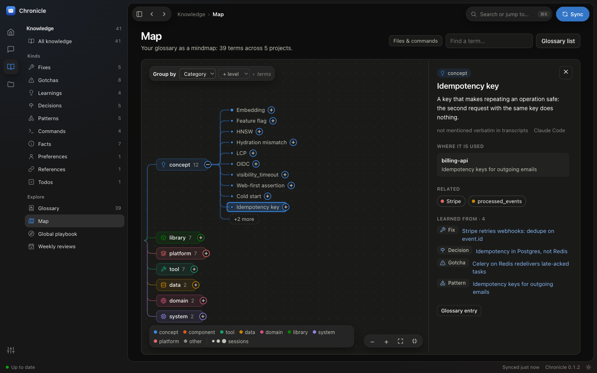

# ダッシュボード、用語集、マップ

[← Chronicle](../../README.ja.md) · [ドキュメント一覧](README.md)

**ダッシュボード：** VS Code を簡素にしたレイアウトを、Apple の Liquid Glass のスタイルで。左端のアイコンレールで
**ホーム**、**セッション**、**ナレッジ**、**プロジェクト**、**設定**を切り替え、その横のサイドバーにそのセクションの一覧が出ます
（最後に動いた日ごとの最近のセッションとエージェントの絞り込み、件数付きのナレッジの種類と用語集・マップ・グローバルプレイブック・週次の振り返り、
プロジェクト、または状態・ソース・外観）。**⌘K**（⌘P や `/` でも可）で開くパレットから、任意のセッション、ナレッジ、プロジェクト、
用語、ページに移動したり、コマンド（同期、用語集の再構築、テーマのグループ化、テーマの切り替え）を実行したりできます。**⌘B** で
サイドバーを隠せます。ステータスバーにはバックグラウンドの処理、分析待ちの件数、最後の同期、見つかったアップデート（[アップデート](install.md#アップデート)）が出ます。ガラスはナビゲーションの層
（レール、サイドバー、ツールバー、パレット、マップの浮いた操作部）だけに使い、ページ本体は不透明な面に置きます。**Settings › Appearance** で
テーマを選び、「透明度を下げる」をオンにできます。アプリでは macOS の同名の設定にも従います。

## キーボードショートカット

| キー | |
| --- | --- |
| ⌘K、⌘P または `/` | 任意のセッション、ナレッジ、プロジェクト、用語、ページを検索または移動。コマンドを実行 |
| ↑ ↓、↵、Esc | パレットの結果を移動、1 つを開く、パレットを閉じる |
| ⌘B | サイドバーの表示／非表示 |
| Esc | パレットを閉じる。幅の狭いウインドウではサイドバーを閉じる |

macOS 以外では ⌘ の代わりに Ctrl を使います。macOS アプリでは、ツールバーをドラッグしてウインドウを動かし、ツールバーをダブルクリックすると拡大／縮小します。

## ページ

ページ：ホーム（稼働時間の見出しと稼働日数・最長連続日数、スパークライン付きの統計タイル（比較できる前の期間がそろうまでは
1 日あたりの値）、7 日平均付きの日次グラフ、結果の内訳、連続記録付きのアクティビティカレンダー、最も忙しい時間帯、プロジェクト、
失敗した呼び出しを含むツール、モデル、エージェント）、並べ替え・絞り込みできるセッション一覧、12 週間の活動を示すプロジェクトカード、
セッションページ（上部に主要な数値、要約、そこから得られたナレッジ。その下で**トランスクリプト**（入力と出力を開ける 1 行の
ツール呼び出しとサブエージェントのスレッドを含む会話）と**詳細**（目的、ハイライト、未解決の事項、ナレッジ、コンパクションを含む
コンテキストウインドウのグラフ、ツール、ファイル、サブエージェント、PR）を切り替えます。幅の広いウインドウでは、プロンプトと
変更したファイルの**アウトライン**がトランスクリプトの横に並び、スクロールに追従します）、ナレッジブラウザー（ピン留め／却下）、
プロジェクトのナレッジベース、グローバルプレイブック、用語集、用語集のマインドマップ（後述の「マップ」）、週次の振り返り、
メッセージに直接飛べる検索。用語集の用語は、表示される場所（トランスクリプト、ナレッジ、要約）ではどこでも下線付きになり、
ホバーで定義、クリックで項目を表示します。すべてのグラフに表形式の表示があり、ライトとダークのテーマに対応しています。

## 用語集

生のトランスクリプトではなく、各プロジェクトから抽出されたナレッジをもとに Claude が作成します。プロジェクトごとに 1 回の
呼び出しと、プロジェクト横断の 1 回の処理で作られ、プロジェクトのナレッジベースが再統合されるたびに更新されます。各用語には、
カテゴリ、別名（略語や日本語の業務用語の訳など）、定義、プロジェクトごとの使われ方、関連用語、全文検索による統計（言及したセッション数、
最初と最後に見た日、言及の多いセッション）があります。

## マップ

ダッシュボードの **Map** ページは、用語集を折りたためるマインドマップとして描きます。マップ左上の **Group by** で、
**Category**（カテゴリ）、**Theme**（テーマ）、**Project**（プロジェクト）、**Agent**（その用語を学んだセッションのエージェント）の
4 つの階層を好きな順に重ねられ、最後に用語が並びます。サイドパネルの **Views** には、よく使う組み合わせ（Category › Theme、
Project › Category › Theme、Category › Project、Agent › Category › Theme）があります。用語を開くと、その元になったナレッジ項目と、
その用語に最も多く言及したセッションが表示されます。ノードをクリックすると開閉し、詳細を表示します：用語なら定義、各プロジェクトでの
使われ方、関連用語（クリックでその用語へ移動）、ナレッジとセッション。カテゴリならそのテーマ、テーマならその説明です。ドラッグまたは
スクロールで移動、ピンチまたは ⌘＋スクロールでズームします。**Find a term** で用語までの経路を開き、開いた枝が画面に収まるよう
表示が自動で移動します。色はカテゴリを表し（大きい 8 カテゴリは固有の色、それ以外は灰色。プロジェクトとエージェントの階層は無彩色）、
用語の点の大きさは言及したセッション数に応じて変わります（1、2〜4、5 以上）。ファイル名とコマンドは **Files & commands** をオンにするまで
非表示です。1 つの枝に描くのは最大 10 ノード（最上位は 12、用語はナレッジ最大 6 件とセッション最大 4 件）で、よく話題になったものから並び、
残りは *+N more* からサイドパネルで一覧できます。一覧は入力しながら絞り込め、選んだものだけがマップに追加されます（検索や関連用語の
リンクも同じ動きです）。用語集の各項目には、マップ上の位置へのリンク（*on the map →*）があります。

## テーマ

用語が 25 以上あるカテゴリは、Claude が 4〜10 個の名前付きテーマに分けます（例：concept →
「Cloud infra, auth & integrations」「Agent dev workflow & tooling」）。カテゴリごとに `claude -p` を 1 回呼び出すので、マップのどの階層も
長い一覧になりません。テーマは用語集の再構築後に、用語が変わったカテゴリだけ作り直されます。それまでに追加された用語は
*Not grouped yet* と表示されます。手動では `chronicle glossary --themes [--force]`、またはマップのサイドパネルの **Group with Claude**
ボタンで実行できます。用語数 1,360 の用語集では、大きい 10 カテゴリの合計が API 定価換算で約 $1.40 でした。
